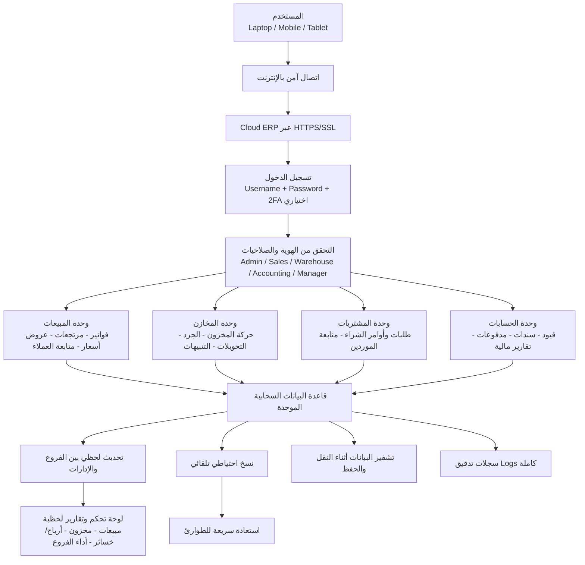

# الخطة الأولى: Cloud System — Workflow موحّد ومفصّل لنظام ERP

## 1) الهدف التشغيلي
هذه الخطة تعتمد على استضافة نظام ERP على بنية سحابية (Cloud Hosting) بحيث تعمل كل الفروع والإدارات على نفس قاعدة البيانات بشكل لحظي عبر الإنترنت.

تشمل المنظومة:
- المبيعات
- المخازن
- المشتريات
- الحسابات
- إدارة العملاء
- التقارير ولوحات المتابعة
- إدارة المستخدمين والصلاحيات

---

## 2) الرسم الموحد للـ Workflow (Mermaid)

---

## 3) مراحل التشغيل بالتفصيل

### المرحلة 1: الدخول والوصول
- المستخدم يفتح النظام من أي جهاز متصل بالإنترنت.
- كل الاتصال يتم عبر HTTPS/SSL.
- المصادقة الأساسية: اسم مستخدم + كلمة مرور.
- المصادقة المتقدمة: 2FA (رسالة/تطبيق Authenticator) لرفع الأمان.

### المرحلة 2: التحكم في الصلاحيات
- يتم تطبيق نموذج RBAC (Role-Based Access Control).
- كل دور يرى فقط الوحدات والعمليات المسموح بها.
- أمثلة:
  - Sales: الفواتير والعملاء فقط.
  - Warehouse: المخزون والجرد والتحويلات.
  - Accounting: القيود، المدفوعات، التقارير المالية.
  - Admin: إدارة المستخدمين والسياسات.

### المرحلة 3: تنفيذ العمليات اليومية
- **المبيعات:** إنشاء فاتورة، خصومات، مرتجعات، متابعة تحصيل.
- **المخازن:** إضافة/صرف، جرد دوري، تسويات، تحويل بين مخازن.
- **المشتريات:** دورة طلب شراء → أمر شراء → استلام.
- **الحسابات:** ترحيل القيود آليًا من العمليات التشغيلية.

### المرحلة 4: التحديث اللحظي
- أي عملية في أي فرع تُحدث مباشرة في قاعدة البيانات الموحدة.
- مثال تشغيلي:
  1. فرع الإسكندرية يبيع منتجًا.
  2. الكمية تُخصم فورًا من المخزون.
  3. الحسابات تُحدّث القيد المرتبط.
  4. الإدارة تشاهد الأثر فورًا في Dashboard.

### المرحلة 5: التقارير والتحليلات
- تقارير تشغيلية ومالية لحظية:
  - إجمالي المبيعات اليومية/الشهرية.
  - أفضل المنتجات.
  - هامش الربح والأرباح والخسائر.
  - مخزون آمن/منخفض/راكد.
  - أداء كل فرع ومندوب.

### المرحلة 6: الحماية والاستمرارية
- نسخ احتياطي تلقائي (يومي/متكرر).
- تشفير البيانات in-transit وat-rest.
- Audit Logs لكل العمليات الحساسة.
- خطة Disaster Recovery بزمن استعادة واضح.

---

## 4) عناصر البنية الفنية المقترحة
- Cloud Application Server (ERP Backend + API).
- Cloud Database (Primary + Read Replica اختياري).
- Object Storage للمرفقات.
- IAM لإدارة الهويات.
- Monitoring & Alerts (APM + Infra Monitoring).
- WAF + Rate Limiting + Secrets Management.

---

## 5) المزايا والقيود

### المزايا
- وصول من أي مكان.
- توسع أسهل مع زيادة الفروع.
- تحديثات مركزية سريعة.
- جاهزية أعلى للخدمة عند التصميم الصحيح.

### القيود
- اعتماد عالٍ على جودة الإنترنت.
- تكلفة اشتراك وتشغيل شهرية.
- يتطلب حوكمة واضحة للبيانات لدى مزود الخدمة.

---

## 6) الشكل المختصر النهائي

**User → Internet → Cloud ERP → Database → Real-time Sync → Dashboard → Backup**
