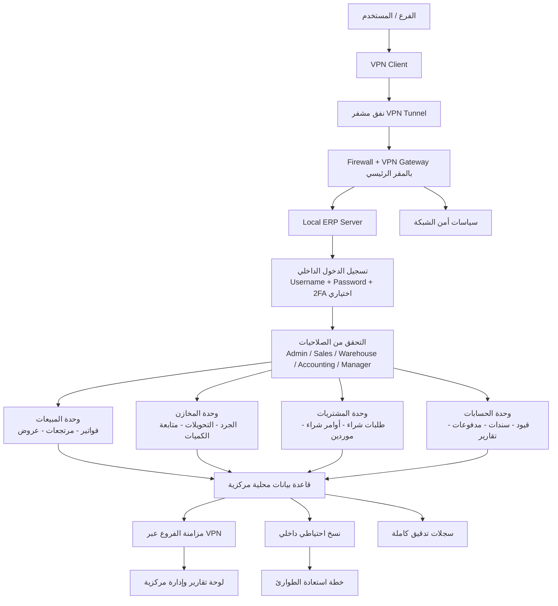

# الخطة الثانية: Local Server + VPN — Workflow موحّد ومفصّل لنظام ERP

## 1) الهدف التشغيلي
هذه الخطة تعتمد على تشغيل نظام ERP داخل الشركة (On-Premises) على سيرفر محلي، مع ربط الفروع الخارجية عبر VPN مشفر للوصول الآمن إلى نفس النظام المركزي.

تشمل المنظومة:
- المبيعات
- المخازن
- المشتريات
- الحسابات
- إدارة العملاء
- التقارير ولوحات المتابعة
- إدارة المستخدمين والصلاحيات

---

## 2) الرسم الموحد للـ Workflow (Mermaid)

---

## 3) مراحل التشغيل بالتفصيل

### المرحلة 1: تجهيز مركز البيانات الداخلي
- تركيب سيرفر رئيسي بالمقر.
- تثبيت نظام ERP وقاعدة البيانات.
- إعداد Firewall وقواعد الوصول.
- إعداد VPN Server/Gateway.
- تأمين الكهرباء، UPS، والتبريد والنسخ الاحتياطي.

### المرحلة 2: ربط الفروع عبر VPN
- كل فرع يثبت VPN Client.
- إنشاء قنوات اتصال مشفرة Site-to-Site أو Remote Access.
- تفعيل سياسات الوصول حسب الفرع/المستخدم.
- بعد الاتصال يصبح الفرع منطقيًا ضمن شبكة الشركة.

### المرحلة 3: الدخول والتحكم بالصلاحيات
- تسجيل دخول المستخدم للنظام الداخلي.
- تطبيق RBAC لتحديد الوحدات المسموحة.
- يمكن فرض 2FA وحظر IP/Device حسب السياسات.

### المرحلة 4: تنفيذ العمليات اليومية
- **المبيعات:** فواتير، مرتجعات، عروض، تحصيل.
- **المخازن:** جرد، تحويلات، تسويات مخزون.
- **المشتريات:** دورة اعتماد وشراء واستلام.
- **الحسابات:** قيود محاسبية ومدفوعات وتقارير.

### المرحلة 5: المزامنة والتجميع المركزي
- جميع عمليات الفروع تُحفظ في قاعدة السيرفر المحلي المركزي.
- المزامنة تتم عبر VPN مع الحفاظ على أمان النقل.
- الإدارة الرئيسية تحصل على رؤية موحدة للفروع.

### المرحلة 6: الحماية والاستمرارية
- تشفير VPN + Firewall Segmentation.
- سياسات صلاحيات وشبكات دقيقة.
- نسخ احتياطي داخلي/خارجي (Offsite اختياري).
- إجراءات Disaster Recovery واختبارات دورية للاسترجاع.

---

## 4) عناصر البنية الفنية المقترحة
- Local Application Server (ERP Backend + API).
- Local Database Server (Primary + Replica اختياري).
- VPN Concentrator / Firewall Appliance.
- AD/LDAP أو IAM داخلي لإدارة المستخدمين.
- SIEM/Log Server للتدقيق الأمني.
- Monitoring للبنية الداخلية وسعة الشبكة.

---

## 5) المزايا والقيود

### المزايا
- تحكم كامل في البيانات داخل الشركة.
- توافق أعلى مع سياسات أمن صارمة.
- أداء ممتاز داخل الشبكة المحلية.
- مناسب للقطاعات التي تقيد الاستضافة الخارجية.

### القيود
- تكلفة تأسيس أعلى (سيرفرات + شبكة + أمن).
- يحتاج فريق IT قوي لإدارة التشغيل والصيانة.
- أي عطل مركزي قد يؤثر على كل الفروع إن لم توجد جاهزية عالية.

---

## 6) الشكل المختصر النهائي

**Branch → VPN Connection → Local Server → Database → Branch Sync → Reports → Backup**
